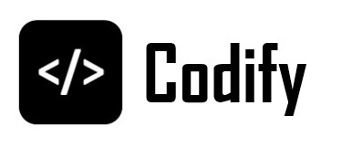
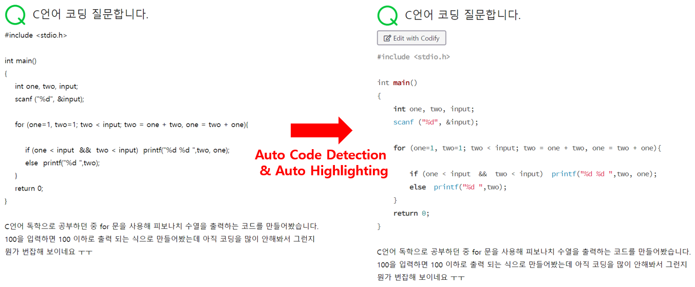
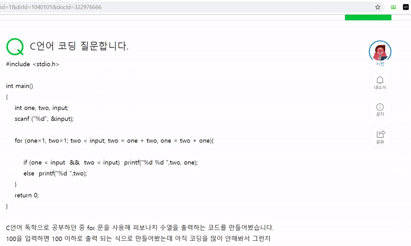
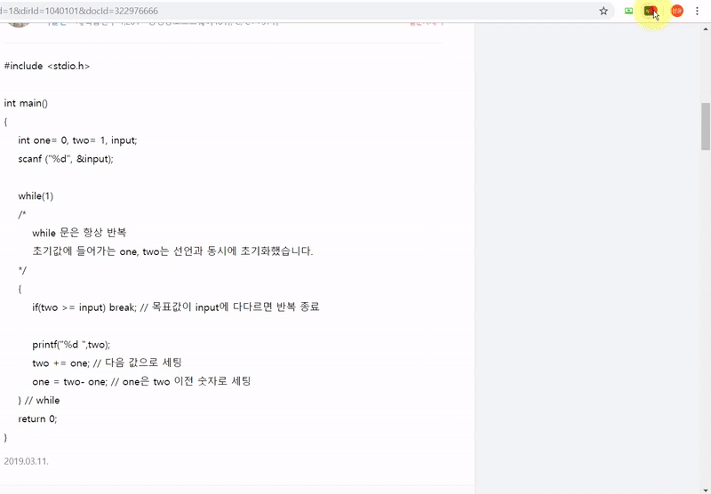
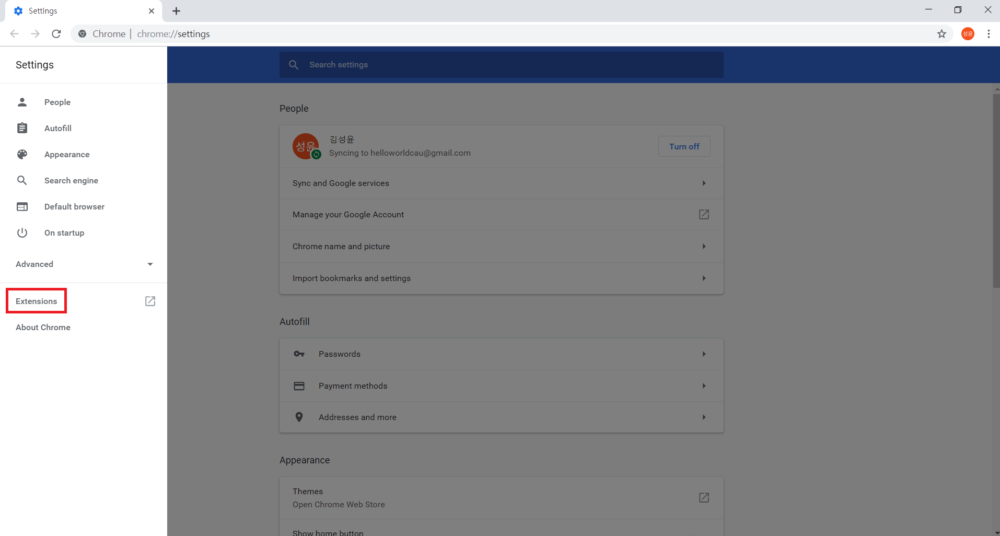
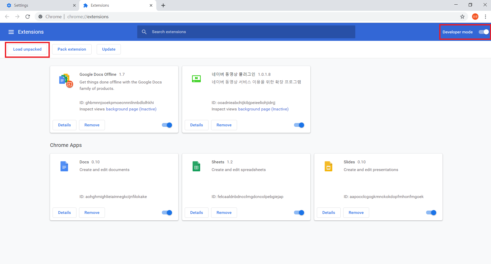
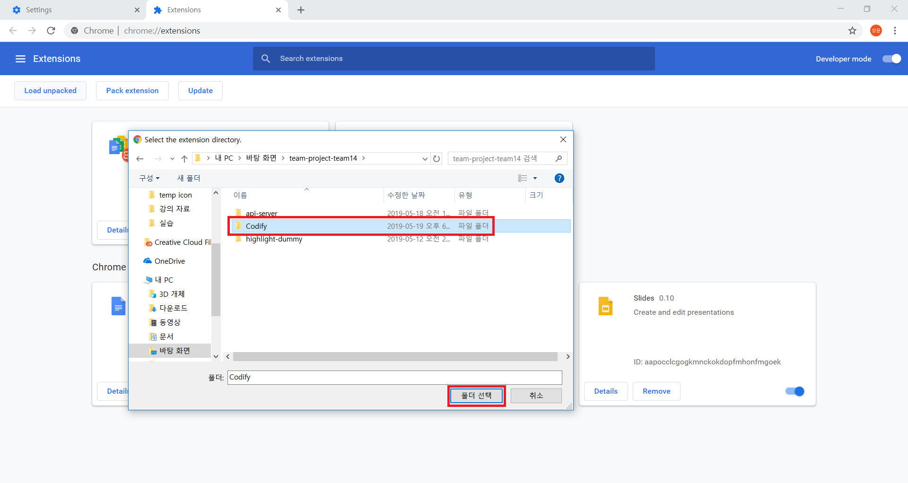
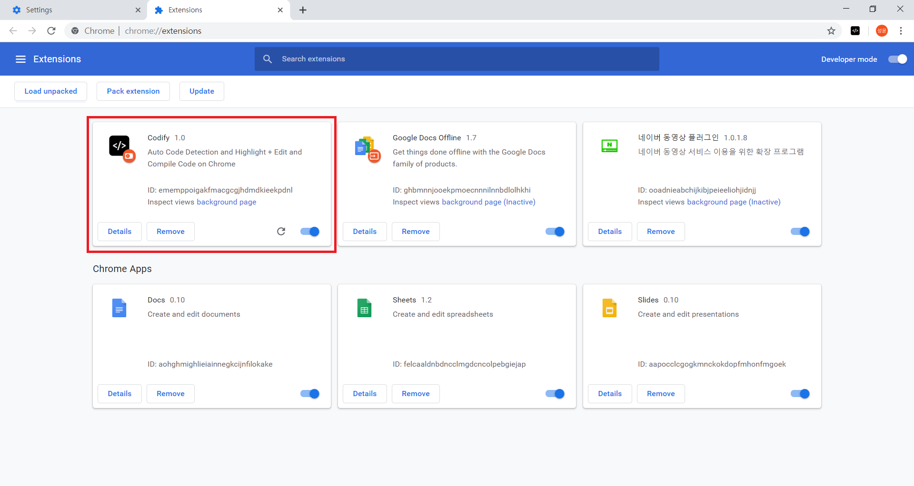

# Codify

Codify는 웹 페이지 상에 텍스트 형태로 존재하는 **코드를 자동으로 인식하여 포맷팅하고 간단히 코드 편집, 컴파일 및 실행 결과를 확인할 수 있도록 하는 브라우저 확장 프로그램**입니다.

본 저장소는 클라이언트 브라우저상의 확장 프로그램뿐만 아니라 소스 코드를 컴파일 및 실행하는 서버 소프트웨어 등이 함께 포함된 통합 솔루션을 관리합니다.

## 서비스 소개

Codify는 웹 페이지 상에 텍스트 형태로 존재하는 C, C++ **코드를 자동으로 인식(Detection)하고 포맷팅(Highlighting)** 합니다.

### Editor

웹 페이지 상의 **코드를 Editor로 가져와 편집** 할 수 있습니다.

(**Edit with Codify** 버튼을 통해 자동으로 인식된 코드 영역을 Editor로 가져올 수 있으며, 코드 영역 드래그 > 우클릭 > Codify > 'Overwrite to Codify' 또는 'Append to Codify'로 선택된 코드 영역만을 Editor로 가져올 수 있습니다.)

**Run** 버튼을 통해 코드 컴파일 및 실행 결과 확인을 할 수 있습니다. (C(gcc -std=c11), C++(g++ -std=gnu++14) 지원)

**Download** 버튼을 통해 코드를 파일로 다운로드 할 수 있습니다.

### Selector

Selector 메뉴 선택 후 원하는 영역을 **더블클릭** 하여 코드 영역을 수동으로 지정하여 포맷팅 할 수 있습니다.
(이때, 해당 영역 전체가 포맷팅되므로 일부 원하지 않는 영역도 포맷팅 될 수 있습니다.)

### Logger
최근 컴파일 히스토리를 보여줍니다.

### Setting
준비 중

## 크롬 확장 프로그램 설치
1. Chrome Menu > Settings 에서 "Extensions" 클릭

    
2. Developer mode 활성화 후 "Load unpacked" 클릭

    
3. `path/Codify` 폴더 선택

    
4. 완료

    
    
## 확장 프로그램 다운로드

- 크롬 웹 스토어: 준비 중
- 파이어폭스 애드온: 준비 중

## 지원 브라우저

- 준비 중: 크롬, 파이어폭스

## 개발 참여

Codify는 LGPLv3 오픈 소스 소프트웨어입니다. 버그 신고 및 각종 기여를 언제든지 환영합니다.

참여를 원하시는 분은 질서 있고 효율적인 프로젝트 운영을 위해 [CONTRIBUTING.md](./CONTRIBUTING.md)를 먼저 읽어 주시기 바랍니다.

보안 취약점을 발견하셨다면 크래커에게 알려지기 전에 먼저 패치를 작성할 수 있도록 메인테이너들의 이메일로 알려 주시기 바랍니다.